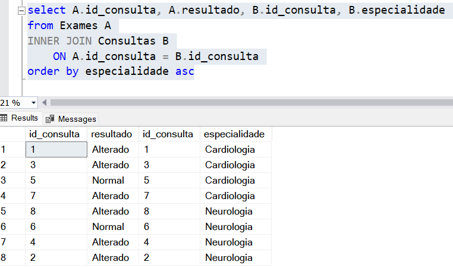

# 🩺 Projeto de Análise de Dados – Pacientes e Exames

> Análise SQL de tabelas relacionadas a pacientes, consultas e exames médicos, com foco em insights demográficos, geográficos e clínicos nas especialidades de Cardiologia e Neurologia.

---

## 📌 Objetivo

Este projeto tem como objetivo analisar os dados contidos nas tabelas **Pacientes**, **Consultas** e **Exames**, visando identificar padrões demográficos, geográficos e clínicos relacionados aos atendimentos médicos especializados em **Cardiologia** e **Neurologia**.

---

## 📊 Análise Demográfica

### 📈 Quantidade por Sexo
- 👨 **Homens:** 4 pacientes  
- 👩 **Mulheres:** 4 pacientes

### 📉 Idade Média
- Média geral: **59 anos**
- Homens: **66 anos**
- Mulheres: **51 anos**

### 🔎 Faixa Etária
- Homens: de **58 a 80 anos**
- Mulheres: de **38 a 72 anos**

**💬 Conclusão:** Homens tendem a procurar atendimento médico mais tardiamente que mulheres, o que pode estar relacionado a questões culturais ou comportamentais. No entanto, os dados não são suficientes para determinar a causa com precisão.

---

## 🌍 Distribuição Geográfica por Região

| Região         | Homens | Mulheres | Total | % Homens | % Mulheres |
|----------------|--------|----------|--------|-----------|-------------|
| Sudeste        |   1    |     1    |   2    |   50%     |    50%      |
| Sul            |   1    |     1    |   2    |   50%     |    50%      |
| Norte          |   1    |     0    |   1    |  100%     |     0%      |
| Nordeste       |   1    |     2    |   3    |  33,3%    |   66,6%     |
| Centro-Oeste   |   0    |     0    |   0    |     -     |     -       |

**💬 Conclusão Regional:**
- A maior incidência feminina está no **Nordeste**.
- A maior incidência masculina está no **Norte**.
- Sudeste e Sul têm **distribuição equilibrada**.
- Centro-Oeste **ainda não possui dados registrados**.

---

## 🧪 Análise dos Exames

### 📋 Exames por Especialidade
- **Cardiologia:** 4 exames, **3 com alterações** (75%)
- **Neurologia:** 4 exames, **3 com alterações** (75%)

📸 **Print do resultado da consulta SQL com INNER JOIN:**

### 📌 Incidência por Tipo de Exame

| Tipo de Exame | Total | Alterados | % Alterados |
|----------------|--------|------------|--------------|
| ECG            |   2    |     1      |    50%       |
| RM             |   2    |     1      |    50%       |
| ECO            |   1    |     1      |   100%       |
| TC             |   1    |     1      |   100%       |
| EEG            |   1    |     0      |     0%       |

**💬 Conclusão:**  
Alta incidência de alterações nos exames (75%) sugere boa triagem médica, com prioridade para exames em casos com maior suspeita clínica.

---

## 🛠️ Melhorias no Desenvolvimento

- ✅ **Criação da coluna `regiao`**: facilitou muito a análise e organização das consultas regionais.
- 📚 **Estudo contínuo de `GROUP BY`, `IN` e junções entre tabelas** para otimizar e reduzir o número de consultas.
- 📌 **Próximos passos**: cruzar mais dados entre tabelas e explorar visualizações com ferramentas como Power BI ou Tableau.

---

## 🧠 Aprendizados Pessoais

> “Poderia, e vou, criar uma coluna adicional sobre regiões, não tê-la deixou meu código um pouco bagunçado com muitos `ORs`.”  
> “Lembrar de usar mais vezes `GROUP BY` e `IN`. Necessito estudar melhor o assunto.”

---

## 👨‍💻 Autor

📎 Desenvolvido por **[@Bifaniii](https://github.com/Bifaniii)**  
🎓 Estudante de Engenharia de Software e apaixonado por tecnologia, dados e soluções eficientes.

---
